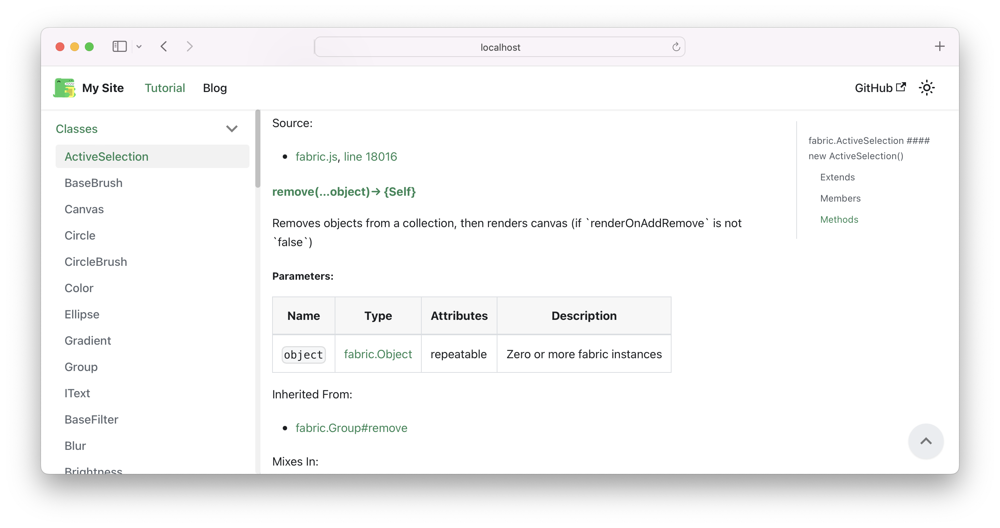

# FabricJS documentation migration



This repository is a proof of concept for migrating documentation to Docusaurus. 

## Project structure

Repository contains unchanged structure from original Docusaurus structure. 

- `migration/old-docs` directory contains fabricjs.com documentation 
- `migration/script/run-migration.js` file contains a script which converts old documentation in HTML (`/migration/old-docs/fabricjs.com/docs/`) to markdown (`/docs/{classes,namespaces}`)

### Start documentation locally

```
npm install
npx docusaurus start
```

Open [http://localhost:3000](http://localhost:3000)

### Invoke migration script

```
cd migration/script
npm install
npm run migration
```

### Work & development 

The main goal and focus should be adjusting html to markdown migration script to minimize the manual work of rewriting and fixing 
documentation issues. 

# Original docusaurus README.md 

This website is built using [Docusaurus 2](https://docusaurus.io/), a modern static website generator.

### Installation

```
$ yarn
```

### Local Development

```
$ yarn start
```

This command starts a local development server and opens up a browser window. Most changes are reflected live without having to restart the server.

### Build

```
$ yarn build
```

This command generates static content into the `build` directory and can be served using any static contents hosting service.

### Deployment

Using SSH:

```
$ USE_SSH=true yarn deploy
```

Not using SSH:

```
$ GIT_USER=<Your GitHub username> yarn deploy
```

If you are using GitHub pages for hosting, this command is a convenient way to build the website and push to the `gh-pages` branch.
